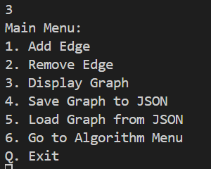

## scala graph project

# Usage Instructions

Our project is split into two sub-projects (core and app). You can move into a specific sub-project with the `sbt` command, then `project core` or `project app`. Once inside, you can run the code with `sbt run`, and you can access the tests with `sbt test`. There are tests in both sub-projects, but nothing to run in the core sub-project. ( Note that you can compile the code with `sbt compile`, but we edited the build.sbt file to automatically compile on run. )

# Global Structure & Design Decisions

We have split our project into two sub-projects : a core and an app sub-project. The core sub-project contains everything in link with algorithms, logic and graph classes. The app sub-project on the other hand contains everything concerning the ZIO 2 application.

### Core Sub-project

We have decided to gather the different graph definition files into a 'graph' package. In order to optimize our code, we decided to make the Graph data structure into a trait. This abstraction allowed us to have a clear and adaptable definition of our main data structure. We decided to use Sets to represent our edges and vertices, since they guarantee uniqueness of the elements they contain. 

Our different types of graphs, which are all implementation of the Graph trait, make use of case classes in their definitions. Our aim with this implementation is to implement immutability, and enable the use of pattern matching. 

We also opted to create a worksheets folder, to centralize the different sheets we've created. In those worksheets, we create scenarios to illustrate and test our different Graph classes and algorithms. On the same line of thought, we created an "algo" folder for the different objects of the algorithms we developed.

Finally, we also created a JSON folder, which contains the JSON encoding and decoding files for each type of graph. In order to implement these transformations, we used the DeriveJsonDecoder function of the zio.json. library.

For the tests, we implemented unit tests using the scalaTest library, and the flatSpec style. They have been grouped into the 'test' folder.

### App Sub-project

Finally, we chose to represent our work with a ZIO 2 app. We decided to focus on a terminal based app. All files regarding the app are stored in a specific sub-project.

We have created a menu system using ZIO.Console, which allows the user to choose between three types of graphs. Once the user has chosen a graph, they can add or remove vertices, visualize the graph, encode it in JSON, decode it from a JSON file, and apply algorithms on it using.

The menu system is implemented in the Main file of the app sub-project. We have also created an AppState file that is used to store the current state of the graph, and the current graph type. This file is used to pass the state of the graph between the different functions of the app and it contains all the functions that are used to interact with the graph.

We test the JSON encoding and decoding for our three types of graphs in the 'test' folder. For each type of graph, we make sure that it can be encoded and decoded correctly.

# Usage Examples

Once you arrive in the project, you can run the app with the `sbt run` command (We have edited the sbt file to ensure that this command automatically compiles the project, and runs the sub-project app). Once you've run the code, you will be met with the following menu.

You will be able to choose between the three different graphs at your disposal by entering a number.

In this second step, you will be able to either :
- Add a vertex 
- Remove a vertex 
- Visualize your graph 
- Encode a graph in JSON
- Decode a graph from a JSON file
- Apply one of our algorithms on your graph 

(adding a vertex)

(Visualize your graph)

If you decide to apply algorithms, you will be presented with interfaces of the following kind :

(Applying the Dijkstra algorithm)

(Encoding a graph into JSON)

# Testing

As mentioned, we used the scalaTest library, and the flatSpec style to develop unit tests for each algorithm and graph class (checking their different functions) in the core sub-project. These tests allow us to verify that each function works as it is intended to, and minimize the risks of eventual complications when we use those functions in more complex algorithms. 

In order to run the tests of both sub-projects, you can use the `sbt test`command. It will display the test results in the terminal.

